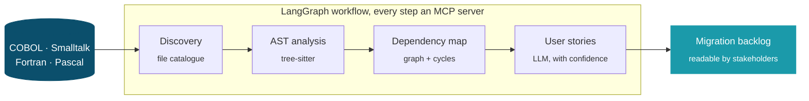
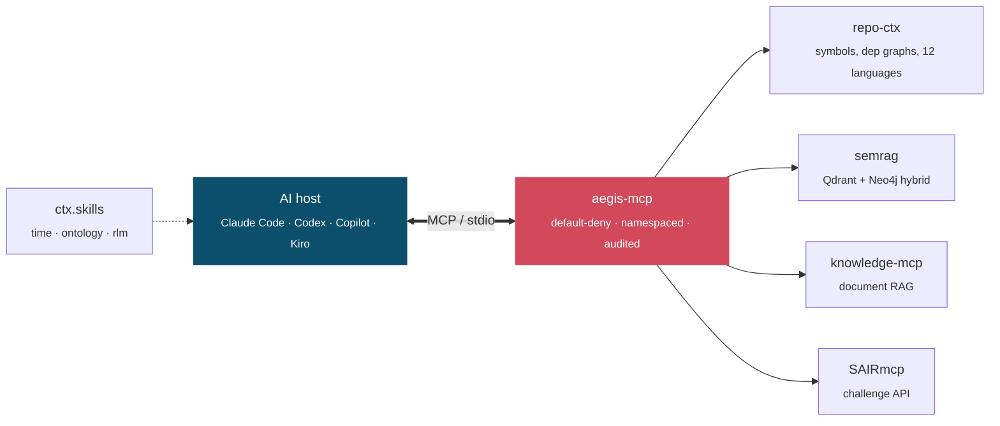

<div align="center">

# Oliver Sick

**Mathematician by training. I build AI systems for enterprise IT that has to work on Monday.**


[](https://www.linkedin.com/in/oliversick/)
[](https://huggingface.co/osick)
<!--[](https://oliversick.de)-->

</div>

<table border="0">
<tr>
<td width="58%" valign="top">

### `whoami`

I own an AI platform as an architect: agentic environments for SAFe value streams
with dozens of teams — the workflows, the MCP servers, the guardrails.

These repositories are where the ideas get tried out before they have to hold up
in a place where an outage is a headline.

Twenty-five years of owning quality in critical systems left me with one bias:
**what you don't measure doesn't work.** It shows in almost everything below.

```console
$ oliver --now
role      AI platform architect · product owner
scale     SAFe value stream, dozens of teams, compliant
building  agent environments · MCP servers · Tools · RAG · 
studying  math, math with AI, distilled by machines, a lot of IT
playing   helpmates, chess exhaustively, math puzzles
```

</td>
<td width="42%" valign="top" align="center">

<picture>
  <source media="(prefers-color-scheme: dark)" srcset="https://raw.githubusercontent.com/osick/osick/main/assets/trapped-knight-dark.svg">
  
</picture>

<sub><b>The trapped knight.</b> Always jump to the lowest unvisited number on a
square spiral. After 2016 squares, every reachable neighbour has been used —
stuck on 2084. Colour runs from the first move to the last.</sub>

</td>
</tr>
</table>

---

## ⛏ Legacy modernization with agents

How do you move a legacy system to a modern architecture when the business logic was
never documented? In 2025 we did exactly that — 50,000 lines, with agents
reconstructing the domain rules from the code itself.



Most reverse-engineering tools stop at syntax. The interesting part is recovering
**business intent** — and then admitting how confident the machine actually is.

| repo | what it does |
| --- | --- |
| **[archaeocode](https://github.com/osick/archaeocode)** | Automated software archaeology. Point it at a legacy codebase, get user stories with acceptance criteria and confidence scores, plus a dependency map. COBOL, Fortran, Pascal, Smalltalk alongside Java, Python, JS, TS. |

---

## 🧩 Context for AI assistants

The model is rarely the problem. The context is. Each of these stands alone —
together they are one agent environment.



| repo | what it does | |
| --- | --- | --- |
| **[repo-ctx](https://github.com/osick/repo-ctx)** | MCP server giving an assistant searchable access to any Git repo: real symbol extraction, dependency graphs, architecture analysis across 12+ languages. Local, GitHub, GitLab, whole orgs. | [](https://pypi.org/project/repo-ctx/) |
| **[ctx.skills](https://github.com/osick/ctx.skills)** | Agent skills for what LLMs are notoriously bad at: telling the time, keeping knowledge structured, reading inputs larger than the context window. Stdlib-only Python. | |
| **[semrag](https://github.com/osick/semrag)** | Local-first enterprise RAG: unstructured vector similarity (Qdrant) blended with structured graph intelligence (Neo4j) in a stateful LangGraph workflow. | |
| **[knowledge-mcp](https://github.com/osick/knowledge-mcp)** | Three MCP servers for document ingestion and semantic search over enterprise document stores. | |

---

## 🛡 Verify, don't hope

An agent you cannot constrain is not a tool, it is a risk. An answer you cannot
check is not an answer.

| repo | what it does | |
| --- | --- | --- |
| **[aegis-mcp](https://github.com/osick/aegis-mcp)** | A zero-trust gateway for MCP, in one Go binary. Capability profiles are default-deny, every tool is namespaced by its origin server so it cannot be shadowed, escalations go through human approval, every decision is audited. Fails closed. |  |
| **[urllm](https://github.com/osick/urllm)** | Point it at any URL, get a grounded GDPR and security audit. Deterministic extraction of the full fingerprint first — cookies, CSP, third-party domains, PII forms, trackers — *then* the LLM. No raw HTML dumped into a prompt. `--fail-on` gates your CI. | |
| **[SpecBench](https://github.com/osick/SpecBench)** | Benchmarked survey of spec-driven development frameworks — the counter-movement to writing code by hoping. | |

---

## ∑ Mathematics

My training, and still the thing I read for pleasure. Currently it is where AI and
mathematics meet: I am competing in the
[Mathematics Distillation Challenge](https://competition.sair.foundation/) of the
SAIR Foundation.

A magma is a set with one binary operation and no laws at all. Impose a single
identity, say

```math
x \ast y \;=\; y \ast (x \ast x)
```

and you have picked one of **4694** equational laws. Which of them imply which
others? That is

```math
4694^2 \;=\; 22{,}033{,}636 \quad\text{implications to settle,}
```

the question the [Equational Theories Project](https://teorth.github.io/equational_theories/)
set out to answer with automated provers and human proofs together.

| repo | what it does |
| --- | --- |
| **[magmaexplorer](https://github.com/osick/magmaexplorer)** | An interactive REPL for the human half of that work. Six mechanically-verified derivation primitives; an LLM may propose derivation steps, but the tool re-executes and verifies every one before it is accepted. Exports to YAML and Lean. |
| **[SAIRmcp](https://github.com/osick/SAIRmcp)** | MCP server for the SAIR Challenges API, so an agent can work the competition with me. |
| **[the-trapped-knight](https://github.com/osick/the-trapped-knight)** | The picture at the top, generalised to $(x,y)$-knights. |

<details>
<summary><b>How far does a greedy knight get?</b> — computed with the library</summary>

<br>

| knight | path length | x-diameter | y-diameter | density |
| --- | ---: | ---: | ---: | ---: |
| $(1,2)$ | 2016 | 55 | 56 | 0.65455 |
| $(1,3)$ | 3723 | 92 | 91 | 0.44470 |
| $(2,3)$ | 4634 | 81 | 81 | 0.70629 |
| $(1,4)$ | 13103 | 125 | 125 | 0.83859 |
| $(17,22)$ | 27154 | 277 | 278 | 0.35262 |
| $(18,23)$ | 27430 | 277 | 283 | 0.34991 |

Density is $\text{length}/(x_{\text{diam}} \cdot y_{\text{diam}})$ — how tightly the
path folds into the space it uses. **No $(x,y)$-knight with an infinite path is
known.** Nor is one known to be impossible.

</details>

---

## ♞ Chess

I love playing chess with a decent [FIDE rating](https://ratings.fide.com/profile/4601513)
And chess is sometimes where the mathematics and IT gets a board. In a helpmate, both sides cooperate: Black moves
first and *helps* White mate in the fewest moves. Because both sides want the same
thing, it is a cooperative shortest-path problem rather than a min/max tree — so
whole material classes become tractable, not just single positions.

| pieces | classes | status |
| ---: | ---: | --- |
| 2–4 | 66 | ✅ complete |
| 5 | 220 | ✅ complete |
| 6 | 645 | 🚧 9 done, **636 to go** |
| 7+ | — | ❌ needs an out-of-core generator that does not exist |

**295 tables, 38.5 GiB** block-compressed, on Hugging Face. The deepest mate in the
corpus is **h#17**. For every legal position the table stores not just the distance
to mate but *how many* optimal solutions tie — so it can tell you whether a
composition is **sound** or has a dual. Anyone can search for a mate; this answers
uniqueness, for every position at once.

> **286 of the missing six-piece tables need only 32 GiB of RAM and about a day of
> CPU each.** If you have a machine that idles overnight, you can compute something
> nobody ever has. → [How to contribute](https://github.com/osick/helpmate-tablebase/blob/main/docs/CONTRIBUTING-TABLES.md)

| repo | what it does | |
| --- | --- | --- |
| **[helpmate-tablebase](https://github.com/osick/helpmate-tablebase)** | Every helpmate in a material class, solved exhaustively. Not a solver you point at one position — a table that already knows. |  |
| **[ChessMG](https://github.com/osick/ChessMG)** | The move generator underneath: magic bitboards in C++20, zero-copy Cython bindings, **200M+ moves/sec** — roughly 50× a pure-Python generator. Verified against perft to depth 8. `pip install chessmg`. | [](https://pypi.org/project/chessmg/) |

---

<details>
<summary>Everything else that is public</summary>

<br>

| repo | |
| --- | --- |
| [amazons](https://github.com/osick/amazons) | Game of the Amazons — engine and analysis |
| [notify-mcp](https://github.com/osick/notify-mcp) | MCP server for team communication and notification |
| [the-trapped-knight.js](https://github.com/osick/the-trapped-knight.js) | The spiral, animated on a canvas |
| [CollatzViz](https://github.com/osick/CollatzViz) · [Collatz](https://github.com/osick/Collatz) | Collatz sequences, visualised and computed for arbitrarily large integers |
| [collision](https://github.com/osick/collision) | A small neural network for collision detection |
| [portfolio](https://github.com/osick/portfolio) | Stock portfolio proof of concept, Streamlit + yfinance |

</details>

<div align="center">
<sub>

Daily driver: Claude Code · Codex · GitHub Copilot · AWS Kiro
&nbsp;·&nbsp;
[LinkedIn](https://www.linkedin.com/in/oliversick/) · [Hugging Face](https://huggingface.co/osick) · <!--[oliversick.de](https://oliversick.de)-->

</sub>
</div>
